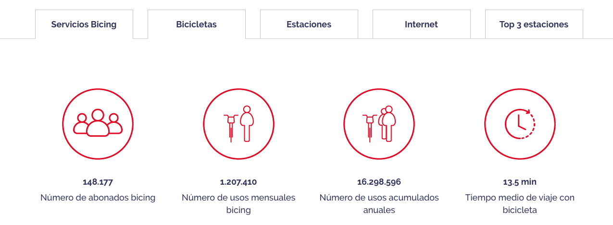
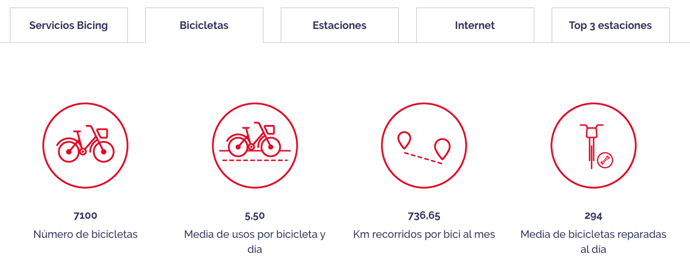
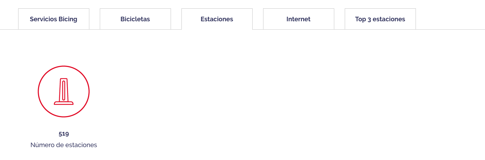
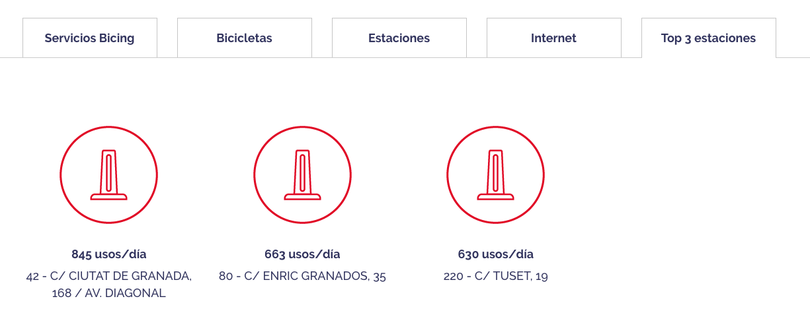

# Final Project - Bike Sharing Bicing

## Dataset: [BCN Bike Sharing Dataset - Bicing Stations](https://www.kaggle.com/datasets/edomingo/bicing-stations-dataset-bcn-bike-sharing)

### Ideas
#### Availabitity analysis 
* weekday, weekend, holidays (festivo)
* Weather impact (if i can find dataset) > 30°  more electric bikes, rain less usage (ofc)
* Docking availability
* Check if Station is not working?
* Detect when the station is being replenish
* Altitude of the station, impact on usage

#### Prediction
* weather
* peak hours
* Week Day /Weekend
* is Holiday

#### Check Bicing prediction system
* [Predictivo de disponibilidad](https://bicing.barcelona/es/faqs-y-normas#reference2-10)

#### Bicing information usage (validate)

* validate [Datos Bicing](https://bicing.barcelona/es/datos-bicing##reference-1)

   
