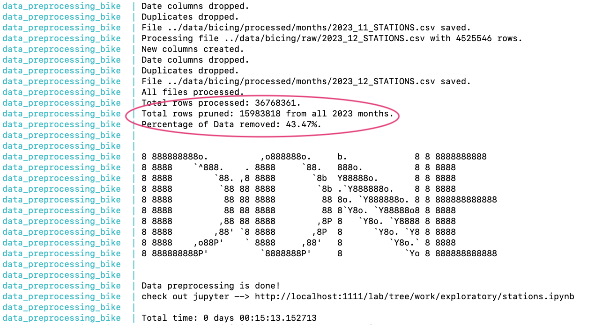

# Final Project - Bike Sharing Bicing - WIP

## Dataset: [BCN Bike Sharing Dataset - Bicing Stations](https://www.kaggle.com/datasets/edomingo/bicing-stations-dataset-bcn-bike-sharing)

### Instructions to run the project
1. `make start`
(🚨🚨🚨this will download 2GB from kaggle into the data folder if it doesn't exist ⏳⏳⏳⏳⏳😅😅)
```* Wait for the Done message and the link!```

2. check jupyter notebooks in --> [here](http://localhost:1111/lab?)
* **EDA**
    * [Stations.ipynb](http://localhost:1111/lab/tree/work/exploratory/stations.ipynb) will have information about ... Stations
    * [weather.ipynb](http://localhost:1111/lab/tree/work/exploratory/weather.ipynb) weather dataset preparation and a few plots
    * [usage.ipynb](http://localhost:1111/lab/tree/work/exploratory/usage.ipynb) EDA related to bikes usage   

* **Machine Learning**
    * [01 - LSTM.ipynb](http://localhost:1111/lab/tree/work/ML/01-LSTM.ipynb) Long Short Term Memory Attempt at prediction Docker Availability (Binary Target)
3. `make stop` or `make kill` to stop the project
---

### Docker Components


# Project Presentation Slides

* [Google Drive](https://docs.google.com/presentation/d/1QbRRdcx5YPAksbv6Nb34_CIaRWsGHNQl_4SPPq6lFDg/edit?usp=sharing
)

# Branches

* Master

`Contains everything nice and tidy`
* [Before-cleanup](https://github.com/SoLNajle/bike-sharing-data-scientist-bc/tree/before-cleanup)

`has all the test, trials, and discarded ideas`

--- 

### Ideas Still WIP 💡💡
#### Availabitity analysis 
* weekday, weekend, holidays (festivo)
* Weather impact (if i can find dataset) > 30°  more electric bikes, rain less usage (ofc)
* Docking availability
* Check if Station is not working?
* Detect when the station is being replenish
* Altitude of the station, impact on usage

#### Prediction
* weather
* peak hours
* Week Day /Weekend
* is Holiday

#### Check Bicing prediction system
* [Predictivo de disponibilidad](https://bicing.barcelona/es/faqs-y-normas#reference2-10)

#### Bicing information usage (validate)

* validate [Datos Bicing](https://bicing.barcelona/es/datos-bicing##reference-1)

   

